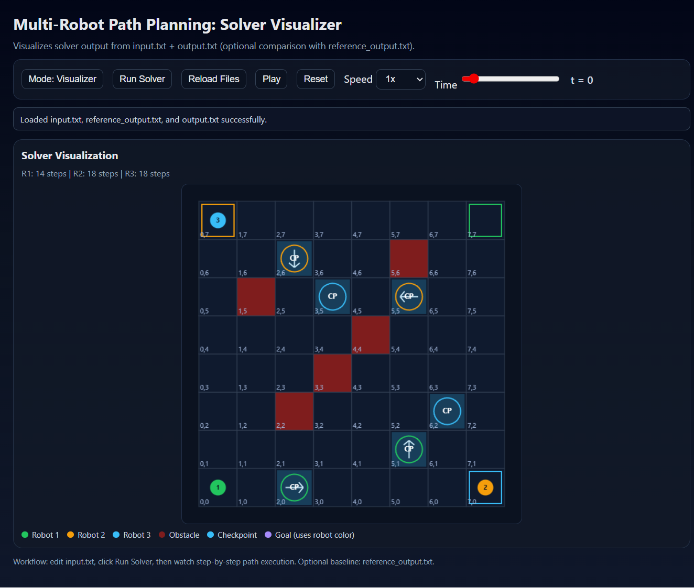
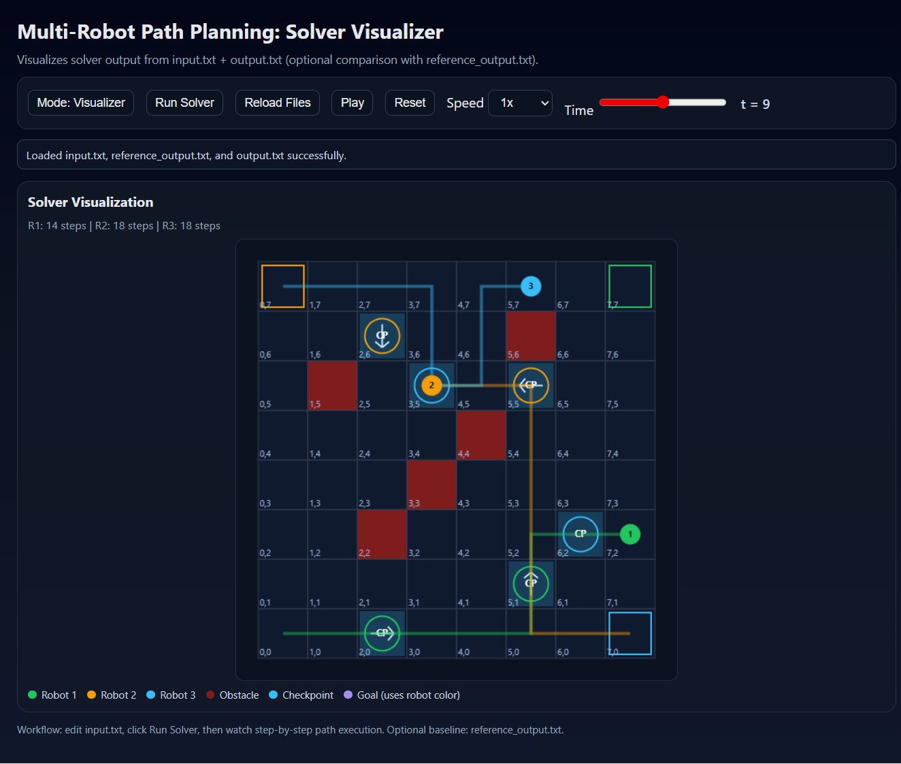
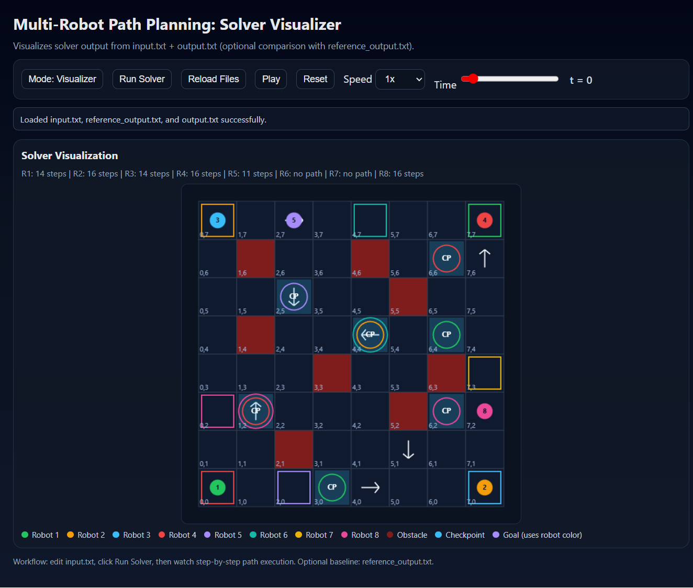

# Multi-Robot Path Planning

## Overview
This project solves a grid-based multi-robot path planning problem using a single search-based planner (**BFS**).

Each robot must:
- start at its given start cell,
- visit checkpoints in order,
- reach its goal within its energy limit,
- obey one-way cell constraints,
- avoid time-step collisions with higher-priority robots.

The solver reads from `input.txt` and writes results to `output.txt`.

## Core Approach
- Robots are sorted by descending priority.
- A path is planned for each robot one-by-one.
- Occupied cells are reserved as `(x, y, t)` and treated as blocked for lower-priority robots.
- BFS state representation: `(x, y, checkpoint_index, time)`.

## Project Files
- `main.py`: Primary solver implementation.
- `input.txt`: Active input instance used by the solver and visualizer.
- `complex_input.txt`: Bundled showcase scenario covering multiple robots, ordered checkpoints, obstacles, one-way cells, and reservation-aware planning.
- `output.txt`: Generated output.
- `reference_output.txt`: Example/reference output.
- `solver_visualizer.html`: Interactive timeline visualizer for solver paths (default mode: solver-only).
- `app_server.py`: Optional local server to run solver from the visualization page.

## Requirements
- Python 3.10+ (standard library only; no external packages required).

## Demo
The repository ships with a more complex showcase case already loaded into `input.txt`.

Quick start:

```bash
python main.py
python app_server.py
```

Then open `http://127.0.0.1:8000/solver_visualizer.html` in your browser.

If you edit `input.txt` and want to restore the bundled showcase case later, copy the contents of `complex_input.txt` back into `input.txt` and run the solver again.

## How to Run
1. Place/edit your problem instance in `input.txt`.
2. Run the solver from the project folder:

```bash
python main.py
```

3. Open `output.txt` to see planned paths or error messages.

## Example Inputs
The repository includes three ready-to-run input-only scenarios:

- `examples/very-basic/input.txt`
- `examples/simple/input.txt`
- `examples/complex/input.txt`

If you are confused about the structure of `input.txt`, review the **Input.txt Explanation** screenshot at the end of this README.

To try one of them, copy it over the root `input.txt` and then run the solver again.

Windows PowerShell examples:

```powershell
Copy-Item .\examples\very-basic\input.txt .\input.txt -Force
python main.py
```

```powershell
Copy-Item .\examples\simple\input.txt .\input.txt -Force
python main.py
```

```powershell
Copy-Item .\examples\complex\input.txt .\input.txt -Force
python main.py
```

## Output Behavior
### Success format (per robot, sorted by Robot ID)
- `Robot <ID>: Path: (x0,y0) -> ... -> (xT,yT)`
- `Total Time: T`
- `Total Energy: E`

### Failure format
- `Error: No valid path found for Robot <ID>`

## Solver Visualizer
Use the visualizer to inspect how paths are achieved over time:

1. Start the local server:

```bash
python app_server.py
```

2. Open `http://127.0.0.1:8000/solver_visualizer.html` in your browser.
3. Use **Reload Files** to load the latest input.txt and output.txt
4. Then Use **Run Solver** to run the solver on the latest input.txt and create the updated output.txt.
5. Use **Play**, **Reset**, and the **Time** slider to follow path progress step-by-step.

Visualizer modes:
- `Visualizer` (default): shows solver output only.
- `Comparison` (optional): shows reference and solver output side-by-side.

**Checkpoint Visualization:**
- Each checkpoint appears as a light blue box with a black "CP" label.
- Colored rings indicate which robots must visit that checkpoint: one ring per robot, using that robot's color.
- Shared checkpoints display concentric rings, making multi-robot dependencies immediately visible.

## Screenshots
The screenshots below show both a smaller baseline scenario and the current larger stress case loaded into `input.txt`.

### Simple Example at Start

Baseline scenario at `t = 0`, showing the initial layout and checkpoint assignments.

### Simple Example Mid-Run

Baseline scenario during execution, with partial paths visible across the grid.

### Complex Example at Start

Current 8-robot scenario at `t = 0`, including denser routing, more checkpoints, and multiple robot priorities.

### Complex Example Mid-Run

Current 8-robot scenario during execution, showing concurrent progress, reservations, and robots that fail to find a path.

### Input.txt Explanation

Reference image explaining how to read and interpret the `input.txt` structure.

## Notes
- `main.py` resolves paths relative to its own directory, so keep `input.txt` in this folder.
- Collision handling blocks same-cell occupancy at the same time step.
- Edge-swap conflict handling is intentionally not included in this version.
